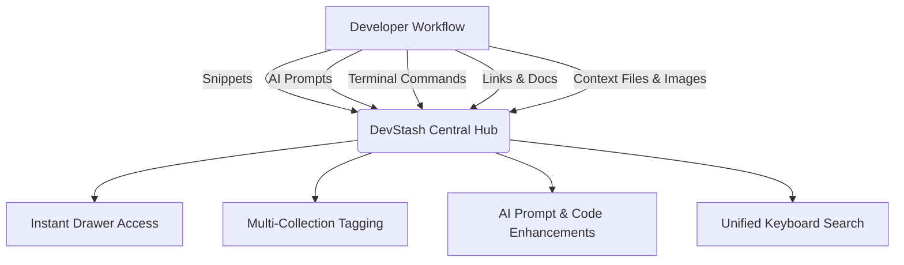
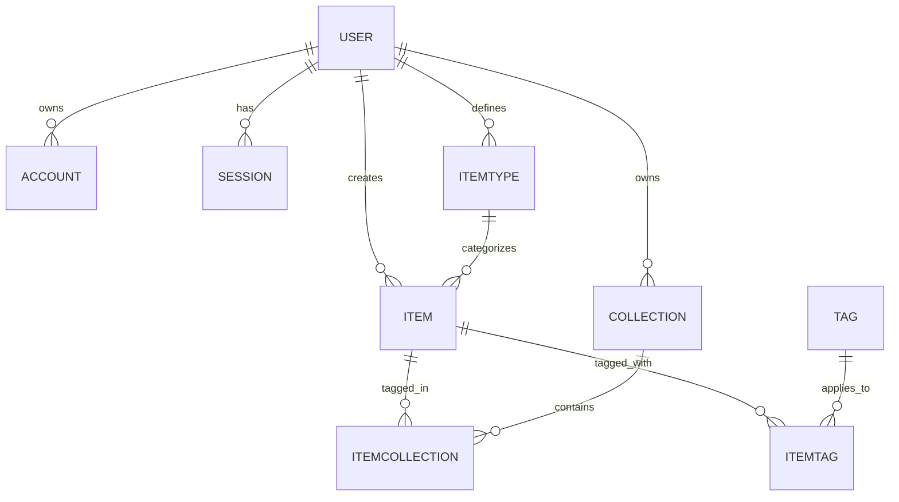
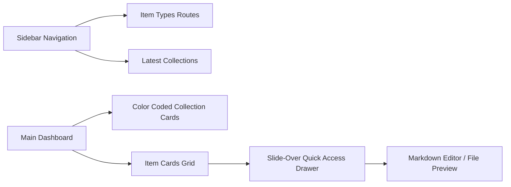

# 🚀 DevStash — Project Specification & Architecture Overview

> **DevStash** is a fast, searchable, AI-enhanced knowledge & resource hub designed specifically for developers. It centralizes code snippets, AI prompts, terminal commands, context files, links, notes, and gists into a single developer-first workspace.

---

## 🎯 Executive Summary & Core Problem

### The Problem
Modern developers keep their essential knowledge and resources scattered across multiple incompatible tools:
- **Code Snippets** buried in VS Code gists, scratch files, or Notion notes.
- **AI Prompts & System Messages** saved in ChatGPT history, Claude chats, or local text files.
- **Context Files & Spec Docs** lost inside individual project subdirectories.
- **Useful Resources & Docs** scattered across browser bookmarks.
- **Terminal Commands & Scripts** lost in shell history (`~/.zsh_history`) or random `.txt` files.

This results in constant **context switching**, **duplicated effort**, **lost knowledge**, and **inconsistent team workflows**.

### The Solution: DevStash
DevStash unifies all developer knowledge into **ONE** high-performance, keyboard-accessible, keyboard-first dashboard with instant drawer-based access, automated AI tagging, and multi-collection organization.



---

## 👥 Target User Personas

| User Persona | Key Needs & Pain Points | Primary DevStash Features Used |
| :--- | :--- | :--- |
| **Everyday Developer** | Fast, frictionless access to reusable snippets, CLI syntax, and framework commands. | Keyboard shortcuts, Drawer preview, Tag filtering, System Commands/Snippets. |
| **AI-First Developer** | Organizes custom system prompts, RAG context snippets, and agent instructions. | AI Prompt Optimizer, Prompt item types, AI auto-tagging. |
| **Content Creator / Educator** | Stores code blocks, course notes, tutorial snippets, and multi-language samples. | Markdown preview, Syntax highlighting, Data export, Public collections (future). |
| **Full-Stack Builder** | Collects full-stack patterns, boilerplate setup commands, env configs, and API samples. | Multi-collection linking, File/Image storage (Pro), Cloudflare R2 integration. |

---

## 📦 System Item Types & Design System

DevStash provides **7 standard system types** out of the box. Types dictate visual styling, icon usage, default routing, and metadata handling.

### 🎨 Type System Palette & Icons

| Item Type | Category | Icon (Lucide) | Accent Color (Hex) | Route | Access Level | Description / Purpose |
| :--- | :--- | :--- | :--- | :--- | :--- | :--- |
| **Snippet** | Text | `Code` | `#3b82f6` (Blue) | `/items/snippets` | Free & Pro | Syntax-highlighted code fragments & patterns. |
| **Prompt** | Text | `Sparkles` | `#8b5cf6` (Purple) | `/items/prompts` | Free & Pro | AI prompts, system instructions, and LLM templates. |
| **Command** | Text | `Terminal` | `#f97316` (Orange) | `/items/commands` | Free & Pro | CLI scripts, bash commands, docker/git recipes. |
| **Note** | Text | `StickyNote` | `#fde047` (Yellow) | `/items/notes` | Free & Pro | Rich Markdown notes, architectural thoughts, reminders. |
| **Link** | URL | `Link` | `#10b981` (Emerald) | `/items/links` | Free & Pro | Bookmarks, documentation links, API references. |
| **File** | File | `File` | `#6b7280` (Gray) | `/items/files` | **Pro Only** | Spec sheets, PDF guides, context configuration files. |
| **Image** | File | `Image` | `#ec4899` (Pink) | `/items/images` | **Pro Only** | Screenshots, UI wireframes, architecture diagrams. |

### Screenshots

Refer to the screenshots below as a base for the dashboard UI. It does not have to be exact, use it as a reference.

- @context/screenshots/dashboard-ui-drawer.png
- @context/screenshots/dashboard-ui-main.png

---

## 🗄️ Database Architecture & Prisma Schema

DevStash uses **PostgreSQL (Neon)** paired with **Prisma 7 ORM**. Below is the exact, production-ready schema design including NextAuth v5 integration, multi-collection join tables, tag relationships, and Stripe subscription fields.

### 🧬 Entity Relationship Diagram (ERD)



### 📄 Production Prisma Schema (`schema.prisma`)

```prisma
datasource db {
  provider = "postgresql"
  url      = env("DATABASE_URL")
}

generator client {
  provider = "prisma-client-js"
}

enum ContentType {
  TEXT
  FILE
  URL
}

enum SubscriptionTier {
  FREE
  PRO
}

model User {
  id                    String           @id @default(cuid())
  name                  String?
  email                 String?          @unique
  emailVerified         DateTime?
  image                 String?
  passwordHash          String?

  // Stripe & Monetization
  isPro                 Boolean          @default(false)
  tier                  SubscriptionTier @default(FREE)
  stripeCustomerId      String?          @unique
  stripeSubscriptionId  String?          @unique
  stripePriceId         String?
  stripeCurrentPeriodEnd DateTime?

  // Relations
  accounts              Account[]
  sessions              Session[]
  items                 Item[]
  collections           Collection[]
  itemTypes             ItemType[]

  createdAt             DateTime         @default(now())
  updatedAt             DateTime         @updatedAt

  @@index([email])
}

model Account {
  id                String  @id @default(cuid())
  userId            String
  type              String
  provider          String
  providerAccountId String
  refresh_token     String? @db.Text
  access_token      String? @db.Text
  expires_at        Int?
  token_type        String?
  scope             String?
  id_token          String? @db.Text
  session_state     String?

  user User @relation(fields: [userId], references: [id], onDelete: Cascade)

  @@unique([provider, providerAccountId])
  @@index([userId])
}

model Session {
  id           String   @id @default(cuid())
  sessionToken String   @unique
  userId       String
  expires      DateTime
  user         User     @relation(fields: [userId], references: [id], onDelete: Cascade)

  @@index([userId])
}

model VerificationToken {
  identifier String
  token      String   @unique
  expires    DateTime

  @@unique([identifier, token])
}

model ItemType {
  id          String   @id @default(cuid())
  name        String   // e.g. "Snippet", "Prompt", "Command"
  slug        String   // e.g. "snippet", "prompt"
  icon        String   // Lucide icon key
  color       String   // Hex code, e.g. "#3b82f6"
  isSystem    Boolean  @default(true)
  isProOnly   Boolean  @default(false)

  userId      String?  // null for system types, populated for custom user types
  user        User?    @relation(fields: [userId], references: [id], onDelete: Cascade)
  items       Item[]

  createdAt   DateTime @default(now())
  updatedAt   DateTime @updatedAt

  @@unique([userId, slug])
  @@index([userId])
}

model Item {
  id          String      @id @default(cuid())
  title       String
  contentType ContentType @default(TEXT)
  content     String?     @db.Text // Markdown text, prompt string, code, or command
  url         String?     @db.Text // Target URL for link types
  fileUrl     String?     @db.Text // Cloudflare R2 bucket public/presigned URL
  fileName    String?
  fileSize    Int?        // Size in bytes
  description String?     @db.Text
  language    String?     // e.g. "typescript", "python", "bash"
  
  isFavorite  Boolean     @default(false)
  isPinned    Boolean     @default(false)

  userId      String
  user        User        @relation(fields: [userId], references: [id], onDelete: Cascade)

  itemTypeId  String
  itemType    ItemType    @relation(fields: [itemTypeId], references: [id])

  collections ItemCollection[]
  tags        ItemTag[]

  createdAt   DateTime    @default(now())
  updatedAt   DateTime    @updatedAt

  @@index([userId])
  @@index([itemTypeId])
  @@index([isFavorite])
  @@index([isPinned])
}

model Collection {
  id            String   @id @default(cuid())
  name          String
  description   String?  @db.Text
  isFavorite    Boolean  @default(false)
  defaultTypeId String?

  userId        String
  user          User     @relation(fields: [userId], references: [id], onDelete: Cascade)

  items         ItemCollection[]

  createdAt     DateTime @default(now())
  updatedAt     DateTime @updatedAt

  @@index([userId])
}

model ItemCollection {
  itemId       String
  collectionId String
  addedAt      DateTime @default(now())

  item         Item       @relation(fields: [itemId], references: [id], onDelete: Cascade)
  collection   Collection @relation(fields: [collectionId], references: [id], onDelete: Cascade)

  @@id([itemId, collectionId])
  @@index([collectionId])
  @@index([itemId])
}

model Tag {
  id        String    @id @default(cuid())
  name      String    @unique
  items     ItemTag[]

  createdAt DateTime  @default(now())
}

model ItemTag {
  itemId String
  tagId  String

  item   Item @relation(fields: [itemId], references: [id], onDelete: Cascade)
  tag    Tag  @relation(fields: [tagId], references: [id], onDelete: Cascade)

  @@id([itemId, tagId])
  @@index([tagId])
  @@index([itemId])
}
```

---

## 🛠️ Technology Stack

| Layer | Technology | Key Details & Usage |
| :--- | :--- | :--- |
| **Framework** | Next.js 16 (App Router) & React 19 | Server Components (RSC), Dynamic Client Drawer, React Server Actions. |
| **Language** | TypeScript | End-to-end type safety, auto-generated Prisma client types. |
| **Database & ORM** | Neon PostgreSQL & Prisma 7 | Serverless Postgres, explicit migrations (no `db push`), Prisma 7 client. |
| **File Storage** | Cloudflare R2 | S3-compatible, zero egress costs for file & image uploads (Pro tier). |
| **Auth** | NextAuth v5 (Auth.js) | GitHub OAuth + Credentials (Email/Password) provider. |
| **AI Engine** | OpenAI `gpt-5-nano` | Auto-tag generation, code explanations, summary generation, prompt optimizer. |
| **Styling & UI** | Tailwind CSS v4 & Shadcn UI | Dark-mode default, CSS variables, Radix primitives, Lucide icons. |

---

## 💰 Monetization & Tier Matrix

During initial local development, **all features will be accessible to facilitate testing**. In production, the feature gating follows this matrix:

| Feature | Free Tier | Pro Tier ($8/mo or $72/yr) |
| :--- | :--- | :--- |
| **Total Stored Items** | Up to 50 items | **Unlimited** |
| **Collections** | Up to 3 collections | **Unlimited** |
| **System Item Types** | Snippet, Prompt, Command, Note, Link | **All System Types (includes File & Image)** |
| **File / Image Uploads** | ❌ Blocked | **✅ Enabled (Cloudflare R2)** |
| **Custom Types** | ❌ Blocked | **✅ Enabled (Planned update)** |
| **AI Auto-Tagging** | ❌ Blocked | **✅ Enabled (OpenAI)** |
| **AI Code Explain & Summaries** | ❌ Blocked | **✅ Enabled (OpenAI)** |
| **AI Prompt Optimizer** | ❌ Blocked | **✅ Enabled (OpenAI)** |
| **Export Formats** | Basic text | **JSON, Markdown, & ZIP Archive** |

---

## 🖥️ UI / UX Specification & Component Layout



### Key UI Principles
1. **Developer First Aesthetics**: Dark mode by default (slate/zinc palette), Linear-inspired subtle borders, glassmorphism drawer overlays.
2. **Dynamic Collection Cards**: Collection cards derive subtle dynamic background hints based on the dominant `ItemType` contained within them.
3. **Quick Drawer**: Items open instantly in a right-hand slide-over drawer (`Shadcn Sheet`), allowing users to edit code, copy snippets, or optimize prompts without full page reload context switches.
4. **Keyboard-Centric**: `Cmd+K` / `Ctrl+K` global search overlay for searching across content, tags, titles, and types.

---

## 🚦 REST & API Route Roadmap

- `GET /api/items` — Query, filter, and search items (with tag/type/collection filters).
- `POST /api/items` — Create new item (handles file attachment metadata or text payload).
- `PATCH /api/items/[id]` — Update item details, favorite toggle, pin state.
- `DELETE /api/items/[id]` — Delete item.
- `POST /api/upload` — Generate presigned upload URL for Cloudflare R2.
- `POST /api/ai/tag-suggestions` — Extract auto-tags via OpenAI `gpt-5-nano`.
- `POST /api/ai/explain` — Generate code explanations or summaries.
- `POST /api/ai/optimize-prompt` — Refine AI system prompts.
- `POST /api/stripe/checkout` — Initiate Stripe Pro subscription checkout.
